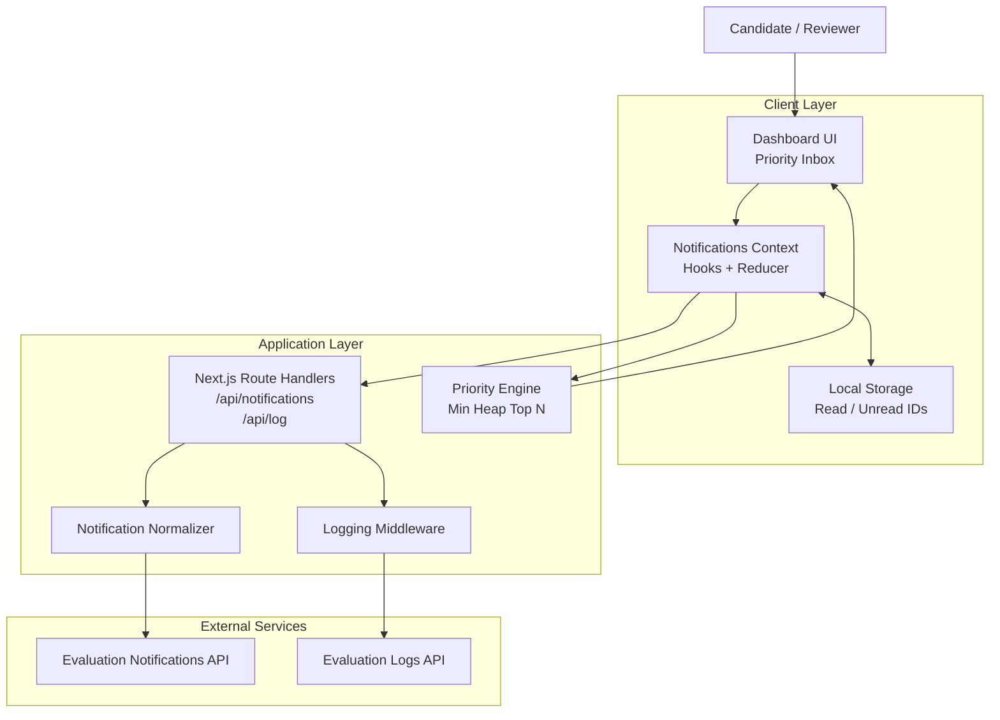
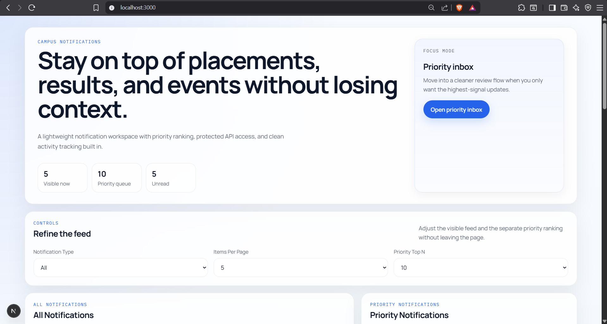
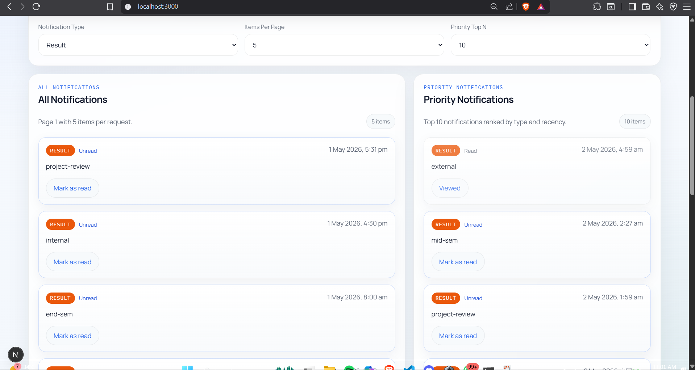
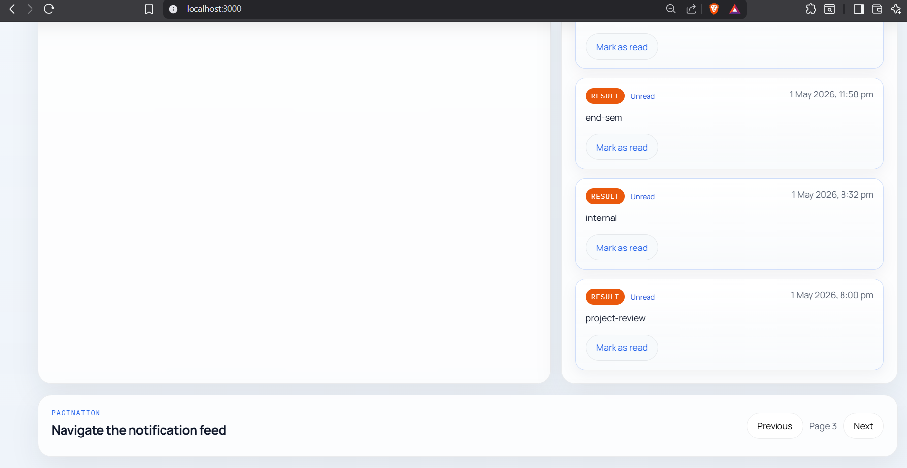
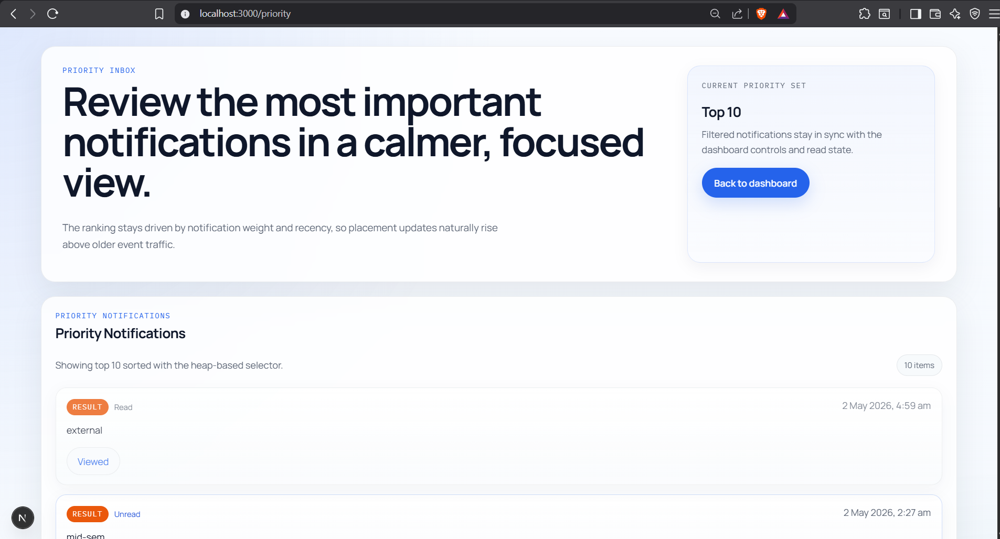
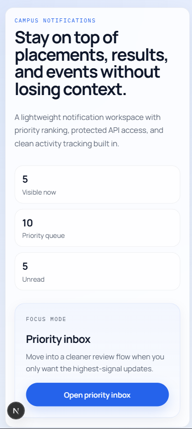
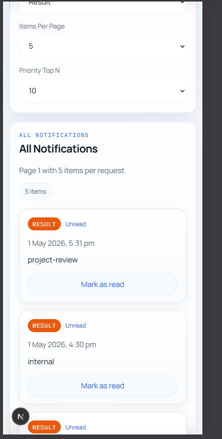
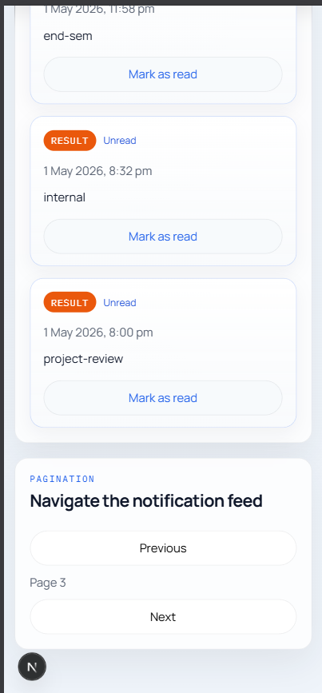
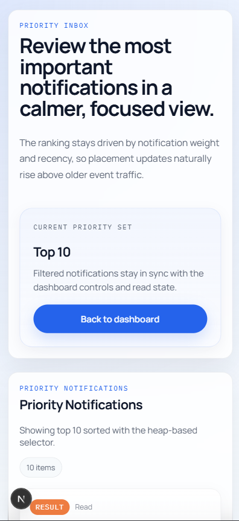
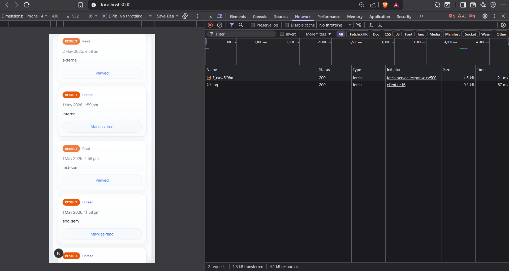

# Campus Notifications Evaluation Submission

This repository contains my frontend-track submission for the campus hiring evaluation. The project implements:

- a reusable logging middleware package
- a heap-based Stage 1 notification prioritization solution
- a full Next.js frontend for Stage 2
- responsive dashboard views for all notifications and priority notifications
- protected API access through server-side route handlers

## Deliverables

The repository is organized around the required frontend-track deliverables:

- [logging_middleware](./logging_middleware)
- [notification_system_design.md](./notification_system_design.md)
- [frontend](./frontend)
- [output_images](./output_images)

## What The App Does

The application solves two parts of the problem:

### Stage 1

The Stage 1 requirement is implemented through a heap-based prioritization module in:

- [frontend/src/utils/notification-heap.ts](./frontend/src/utils/notification-heap.ts)

It returns the top `N` notifications by:

1. type priority: `Placement > Result > Event`
2. recency within the same priority

Instead of sorting the entire dataset every time, the solution maintains a bounded min heap and achieves:

- time complexity: `O(n log k)`
- space complexity: `O(k)`

Detailed design notes are documented in:

- [notification_system_design.md](./notification_system_design.md)

### Stage 2

The frontend is built with Next.js and provides:

- all notifications view
- priority notifications view
- filtering by notification type
- pagination support
- read vs unread tracking
- centralized logging for API calls, UI interactions, and state changes

## Tech Stack

- Next.js 16 App Router
- React 19
- TypeScript
- Vanilla CSS
- Next.js Route Handlers for secure API proxying
- Browser local storage for read-state persistence

## Folder Structure

```text
AffordTest/
  frontend/
    src/
      api/
      app/
      components/
      hooks/
      middleware/
      page-modules/
      pages/
      state/
      utils/
  logging_middleware/
  notification_system_design.md
  output_images/
```

## Authentication Approach

The frontend track explicitly assumes users are already authorized and should not see a registration or login UI.

To satisfy that while still consuming the protected evaluation APIs:

1. a bearer token is generated externally through the evaluation `register` and `auth` endpoints
2. that token is stored locally in `frontend/.env.local`
3. the browser never calls the evaluation server directly
4. Next.js route handlers attach the bearer token server-side

This keeps credentials out of the client bundle while preserving the expected frontend-only user experience.

## Logging Middleware

The shared logging package lives in:

- [logging_middleware/index.js](./logging_middleware/index.js)
- [logging_middleware/index.d.ts](./logging_middleware/index.d.ts)

It exposes a reusable function that conforms to the evaluation requirement:

```ts
log(stack, level, package, message)
```

In this project, logging is used across:

- upstream API requests
- route-handler errors
- client state updates
- user interactions such as filter and pagination changes

## System Architecture

Below is a cleaner layered Mermaid architecture diagram that renders better on GitHub and is easier to read in the README.



Architecture image placeholder for submission:


When the Mermaid diagram is rendered as an image, it can replace the placeholder path above.

## Request Flow

At runtime, the flow is:

1. the user opens the dashboard in the browser
2. the client state layer requests notifications through `/api/notifications`
3. the Next.js route handler adds the bearer token from `.env.local`
4. the protected evaluation notifications API returns the raw payload
5. notifications are normalized and passed to the UI
6. the heap-based priority selector computes the top `N`
7. all important events are logged using the protected logs API through the shared logging middleware

## Key Implementation Files

### Frontend

- [frontend/src/app/page.tsx](./frontend/src/app/page.tsx)
- [frontend/src/app/priority/page.tsx](./frontend/src/app/priority/page.tsx)
- [frontend/src/page-modules/DashboardPage.tsx](./frontend/src/page-modules/DashboardPage.tsx)
- [frontend/src/page-modules/PriorityPage.tsx](./frontend/src/page-modules/PriorityPage.tsx)
- [frontend/src/components/NotificationToolbar.tsx](./frontend/src/components/NotificationToolbar.tsx)
- [frontend/src/components/NotificationListSection.tsx](./frontend/src/components/NotificationListSection.tsx)
- [frontend/src/components/NotificationCard.tsx](./frontend/src/components/NotificationCard.tsx)

### Data And State

- [frontend/src/hooks/useNotificationsController.ts](./frontend/src/hooks/useNotificationsController.ts)
- [frontend/src/state/notification-context.tsx](./frontend/src/state/notification-context.tsx)
- [frontend/src/state/notification-reducer.ts](./frontend/src/state/notification-reducer.ts)
- [frontend/src/utils/notification-types.ts](./frontend/src/utils/notification-types.ts)
- [frontend/src/utils/notification-mappers.ts](./frontend/src/utils/notification-mappers.ts)
- [frontend/src/utils/read-storage.ts](./frontend/src/utils/read-storage.ts)

### Server Proxy And Logging

- [frontend/src/app/api/notifications/route.ts](./frontend/src/app/api/notifications/route.ts)
- [frontend/src/app/api/log/route.ts](./frontend/src/app/api/log/route.ts)
- [frontend/src/api/server.ts](./frontend/src/api/server.ts)
- [frontend/src/middleware/logger.ts](./frontend/src/middleware/logger.ts)
- [logging_middleware/index.js](./logging_middleware/index.js)

## Running The Project

Create:

- `frontend/.env.local`

with:

```env
AFFORDMED_API_BASE_URL=http://20.207.122.201/evaluation-service
AFFORDMED_ACCESS_TOKEN=your_access_token_here
```

Then run:

```bash
cd frontend
npm install
npm run dev
```

Open:

- `http://localhost:3000`

## Verification

The project was verified with:

```bash
npm run lint
npm run build
```

run inside the `frontend` directory.

## UI Screenshots

### Desktop Views






### Mobile Views






### Additional Screen



## Notes

- the frontend does not expose registration or login UI because the frontend track assumes pre-authorized access
- the bearer token is kept in `.env.local` and not committed
- the route-handler layer exists only to protect the token and keep the browser-side app compliant with the evaluation constraints
