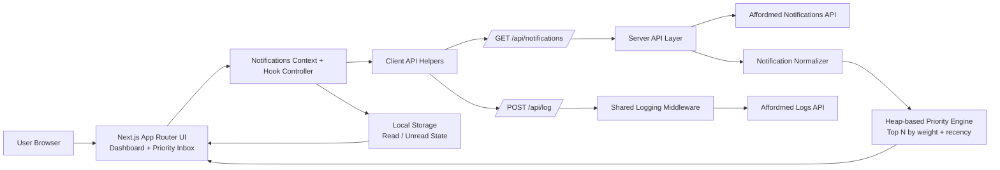

# Campus Notifications Frontend

This Next.js application implements the frontend stage of the campus hiring evaluation:

- secure notification fetching through local API routes
- centralized protected-route logging
- heap-based priority notification selection
- filtering, pagination, and read/unread tracking

## Environment setup

Create `frontend/.env.local` from `.env.example` and set:

- `AFFORDMED_API_BASE_URL`
- `AFFORDMED_ACCESS_TOKEN`

The frontend track assumes pre-authorized access, so the UI does not expose a login or registration screen. The protected upstream API is called only from Next.js route handlers to avoid exposing the bearer token in the browser.

## Run locally

```bash
npm run dev
```

Open `http://localhost:3000`.

## Project structure

```text
src/
  api/
  app/
  components/
  hooks/
  middleware/
  page-modules/
  pages/
  state/
  utils/
```

The shared logging package is located in `../logging_middleware`.

## Architecture

Use the following Mermaid source to generate the architecture image for submission:



Architecture image placeholder:


## Screenshots

Desktop dashboard:


Mobile dashboard:


Priority inbox / additional view:


