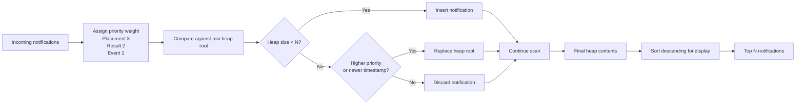

# Stage 1 - Notification System Design

## Objective

The goal in Stage 1 is to return the top `N` notifications while preserving the required ranking order:

1. `Placement`
2. `Result`
3. `Event`

If two notifications belong to the same category, the newer notification should appear first.

## Overview

The implementation lives in `frontend/src/utils/notification-heap.ts` and exposes:

- `getTopNotifications(notifications, limit)`

Instead of sorting the full list every time, the function scans the notifications once and keeps only the best `N` candidates in a fixed-size min heap.

## Processing Diagram

## Sorting logic

Each notification is scored with two values:

- `Placement = 3`
- `Result = 2`
- `Event = 1`
- `timestamp = Date.parse(notification.timestamp)`

The heap stores the current top `N` notifications seen so far. The root of the heap always represents the weakest item among the current winners.

A notification is considered weaker when:

- lower type priority is weaker
- if type priority ties, older timestamp is weaker

For every new notification:

1. If the heap has fewer than `N` elements, insert it.
2. Otherwise compare it with the heap root.
3. If the new notification is stronger, replace the root and heapify.

After the scan finishes, the heap contents are converted to an array and sorted into the final display order:

- higher priority first
- more recent first

## Heap-based optimization

If the full list were sorted directly, the time cost would be `O(n log n)`.

Using a min heap limited to `N` items reduces the work to:

- heap insertion or replacement: `O(log N)`
- repeated over `n` notifications
- total: `O(n log N)`

This is useful because the UI only needs a short priority list, not a fully sorted dataset.

Examples:

- top 5 notifications
- top 10 notifications
- top 20 notifications

## Time and space complexity

- Time: `O(n log N)`
- Space: `O(N)`

## Handling new incoming notifications efficiently

The same structure also works well when new notifications keep arriving over time.

1. Keep the heap in memory.
2. For every new notification, compare it against the heap root.
3. Insert or replace only when it improves the top `N`.
4. Re-sort only the final heap view when the UI needs a stable ranked output.

This avoids re-sorting the whole notification list whenever one more item is added to the stream.
